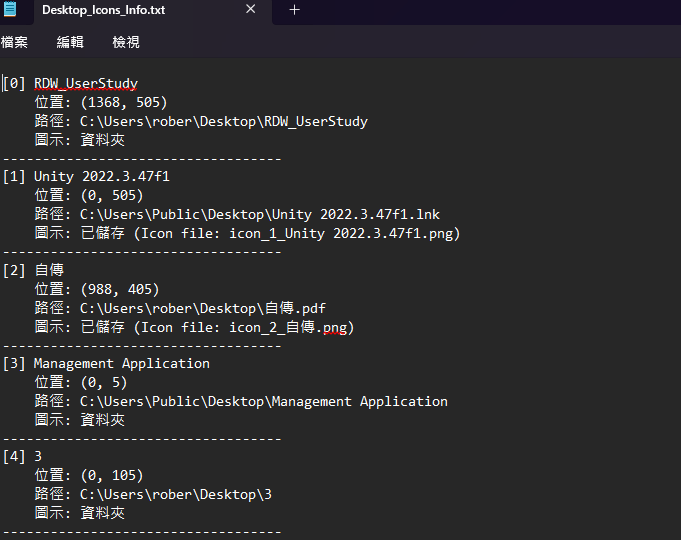
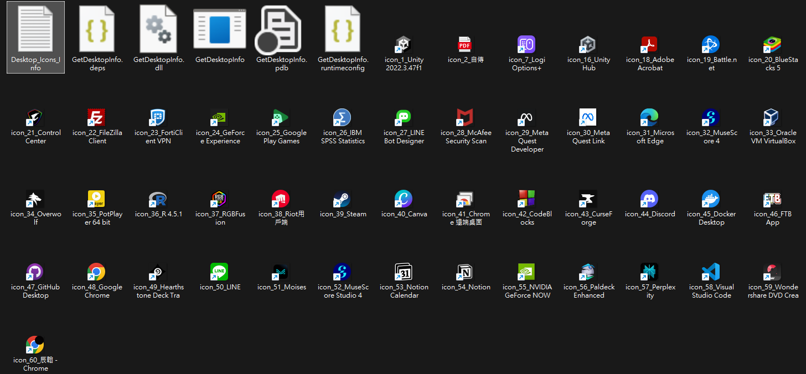

# Desktop Icons Tool

## 執行方法
1. 執行前先將防毒軟體關閉，防毒軟體會阻擋拿取 Icon 的行為
2. 點選 GetDesktopInfo.exe 即可執行

## 執行結果
1. 會將檔名、座標和 icon 等資訊寫在 Desktop_Icons_Info.txt 內
    
2. Icon 目前會先放在執行檔所在的資料夾
    
3. 無法獲取資料夾的圖示，可能你們之後要自己加
4. 像資源回收筒等 Window 在桌面上的虛擬物件沒辦法抓到圖示以及路徑，因為它不是檔案 QAQ

## 其他
1. 目前跑在 Window 11 是可以的
2. 因為不知道怎麼將 C# 和你們的檔案結合，所以目前先放執行檔
3. 目前只有桌面上的圖示，資料夾往下一層還沒做
4. 幫我測一下其他問題，以及告訴我怎麼改你們會比較好開發 :)